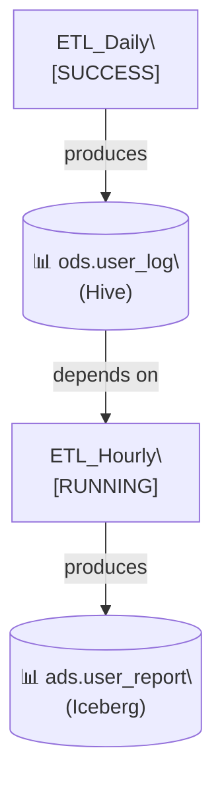

# Job Dependency Analyzer

Analyzes job dependencies from Zeus MCP (job orchestration) and Metadata MCP (table metadata),
builds a dependency graph, generates Mermaid flowchart, and publishes analysis report to Feishu document.

## When to Use This Skill

Use this skill when the user:

1. **Traces job lineage** - "Show me all upstream jobs for job_123"
2. **Analyzes impact** - "What jobs will be affected if I change this table?"
3. **Documents pipelines** - "Create a dependency diagram for our ETL pipeline"
4. **Debugs failures** - "Why did this job fail? Show me its dependencies"
5. **Reviews data flow** - "Visualize the data flow from ODS to ADS layer"

## Quick Start

```bash
# Basic usage - analyze single job
python skills/job-dependency-analyzer/scripts/main.py --job-ids job_123

# Multiple jobs
python skills/job-dependency-analyzer/scripts/main.py --job-ids job_123,job_456

# Limit depth and stop at specific tables
python skills/job-dependency-analyzer/scripts/main.py \
  --job-ids job_123 \
  --max-depth 3 \
  --stop-at-tables "ads.final_table,ads.report_table"

# Create Feishu document
python skills/job-dependency-analyzer/scripts/main.py \
  --job-ids job_123 \
  --feishu-action create \
  --title "Job Dependency Analysis - job_123"

# Update existing Feishu document
python skills/job-dependency-analyzer/scripts/main.py \
  --job-ids job_123 \
  --feishu-action update \
  --doc-token doccnXXX
```

## MCP Configuration

### Zeus MCP

- **Purpose:** Job orchestration, run logs, job dependencies
- **URL:** `http://zeus-osg-mcp-function.faas.ctripcorp.com/mcp`
- **Token:** `x-bbzai-mcp-token` header
- **Session:** Uses `mcp-session-id` header for stateful requests

### Metadata MCP

- **Purpose:** Table metadata for Hive, Iceberg, Paimon, BigQuery, StarRocks
- **URL:** `http://metadata-osg-stream-function.faas.ctripcorp.com/mcp`
- **Token:** `x-bbzai-mcp-token` header
- **Session:** Uses `mcp-session-id` header for stateful requests

### Tool Discovery

Before using this skill, discover available MCP tools:

```bash
python skills/job-dependency-analyzer/scripts/discover_mcp_tools.py
```

This will list all available tools and their input schemas. Update the tool names in `analyze_job_dependency.py` if they differ from defaults.

### Configuration File

MCP credentials are stored in `mcp-config.json` at workspace root:

```json
{
  "mcpServers": {
    "zeus-mcp": {
      "type": "http",
      "url": "http://zeus-osg-mcp-function.faas.ctripcorp.com/mcp",
      "headers": {
        "x-bbzai-mcp-token": "ada_xxx"
      }
    },
    "bigdata-metadata-api-mcp": {
      "type": "http",
      "url": "http://metadata-osg-stream-function.faas.ctripcorp.com/mcp",
      "headers": {
        "x-bbzai-mcp-token": "ada_xxx"
      }
    }
  }
}
```

## Parameters

| Parameter | Required | Default | Description |
|-----------|----------|---------|-------------|
| `--job-ids` | Yes | - | Comma-separated job IDs to analyze |
| `--max-depth` | No | 5 | Maximum dependency traversal depth |
| `--stop-at-tables` | No | - | Comma-separated table names to stop at (e.g., `ads.table,dws.table`) |
| `--feishu-action` | No | `create` | `create`, `update`, or `none` |
| `--doc-token` | No | - | Existing Feishu document token |
| `--folder-token` | No | - | Feishu folder token for new document |
| `--title` | No | `Job Dependency Analysis` | Document title |
| `--output-dir` | No | `/tmp/job-dependency` | Directory for intermediate files |

## Output

### Mermaid Flowchart

Generated flowchart shows:
- **Jobs** as rectangles with status
- **Tables** as cylinders with source type
- **Dependencies** as directed edges

Example:


### Feishu Document

The document includes:
1. Dependency flowchart (Mermaid)
2. Job details (ID, name, status, dependencies, outputs)
3. Table metadata (type, environment, upstream jobs)
4. Usage instructions

## Workflow

### Step 1: Discover MCP Tools

The analyzer first discovers available tools from both MCP servers:

```python
# Zeus MCP tools (examples)
- get_job_info
- get_job_logs
- list_jobs
- get_job_dependencies

# Metadata MCP tools (examples)
- get_table_metadata
- query_table
- list_tables
- get_table_lineage
```

### Step 2: Build Dependency Graph

Starting from input job IDs:
1. Fetch job info from Zeus MCP
2. Extract upstream job dependencies
3. Extract output tables
4. For each table, fetch metadata from Metadata MCP
5. Extract upstream jobs from table metadata
6. Repeat until max depth or stop condition

### Step 3: Generate Flowchart

Convert dependency graph to Mermaid format:
- Jobs → Rectangles with status
- Tables → Cylinders with source type
- Edges → Directed arrows with labels

### Step 4: Publish to Feishu

Use `feishu-doc` skill to:
1. Create new document (or use existing)
2. Write markdown content with embedded Mermaid
3. Return document URL

## Integration with feishu-doc

This skill uses the `feishu-doc` skill for document operations. When `--feishu-action` is set:

1. **Create mode:** Calls `feishu-doc` with `create_and_write` action
2. **Update mode:** Calls `feishu-doc` with `write` action

Example feishu-doc call:
```json
{
  "action": "create_and_write",
  "title": "Job Dependency Analysis - job_123",
  "content": "# Job Dependency Analysis\n\n```mermaid\n...\n```\n..."
}
```

## Termination Conditions

The dependency traversal stops when:

1. **Max depth reached** - Configured via `--max-depth` (default: 5)
2. **Stop tables matched** - Table name matches `--stop-at-tables` pattern
3. **No more dependencies** - Job has no upstream dependencies
4. **Cycle detected** - Job already visited in current path

## Error Handling

| Error | Handling |
|-------|----------|
| MCP server unavailable | Log warning, continue with available data |
| Job not found | Skip job, log warning |
| Table metadata missing | Use placeholder, continue |
| Feishu API error | Save markdown locally, report error |

## Examples

### Example 1: Simple Job Analysis

```bash
python skills/job-dependency-analyzer/scripts/main.py \
  --job-ids "etl_daily_20260323"
```

### Example 2: Full Pipeline Analysis

```bash
python skills/job-dependency-analyzer/scripts/main.py \
  --job-ids "ads_final_report" \
  --max-depth 10 \
  --stop-at-tables "ods.raw_log" \
  --feishu-action create \
  --title "ADS Final Report - Full Lineage"
```

### Example 3: Impact Analysis

```bash
# Find all downstream jobs affected by changing ods.user_log
python skills/job-dependency-analyzer/scripts/main.py \
  --job-ids "ods_user_log_producer" \
  --max-depth 5 \
  --feishu-action create \
  --title "Impact Analysis - ods.user_log"
```

## Troubleshooting

### MCP Connection Issues

```bash
# Test Zeus MCP connection
curl -X POST "http://zeus-osg-mcp-function.faas.ctripcorp.com/mcp" \
  -H "Content-Type: application/json" \
  -H "x-bbzai-mcp-token: ada_xxx" \
  -d '{"jsonrpc":"2.0","id":1,"method":"tools/list","params":{}}'
```

### Feishu Document Not Created

1. Check `FEISHU_APP_TOKEN` environment variable
2. Verify folder token has write permissions
3. Check feishu-doc skill configuration

### Missing Dependencies in Graph

- Increase `--max-depth`
- Check if MCP tools return dependency fields
- Verify job IDs are correct

## Scripts

- `scripts/main.py` - Main entry point
- `scripts/analyze_job_dependency.py` - MCP client and graph builder
- `scripts/update_feishu_doc.py` - Feishu document updater

## Related Skills

- **feishu-doc** - Feishu document operations
- **feishu-mcp-doc** - Feishu document via MCP
- **github** - For creating PRs with dependency analysis
